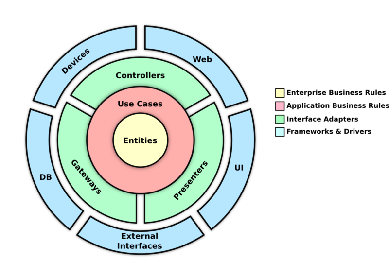

# Clean Architecture Typescript ExpressJS - (omdbapi.com)

GET Search And Detail Movies data from [omdbapi](http://www.omdbapi.com)

### Case Study

#### 1. Search
- Get movies data By keywords
- Each API calls logged into a MySQL table, specifying DateTime.

#### 2. Detail
- Get detail movies by Id
- Each API calls logged into a MySQL table, specifying DateTime.




### Architecture & folder Explaination

In this project, I have 4 layers

1. Domain/Entities
2. Repository
3. Usecase
4. Delivery

#### Domain/Entities
Defines business rules that are shared across all enterprise applications. It can be an object with a method, or a data structure.

#### Repository
This layer is the layer that stores the database handler. Querying, Inserting, Deleting will be done on this layer. There is no business logic here. There are only standard functions for input-output from the datastore.

This layer has the main task of determining what datastore is used. You can choose according to your needs, maybe RDBMS (Mysql, PostgreSql, etc.) or NoSql (Mongodb, CouchDB, etc.).

#### Usecase
This layer is the layer that will handles the business logic in each domain. This layer is also in charge of choosing what repository to use, and this domain can have more than one repository layer.

#### Delivery
This layer is the layer that will serve as a presenter or be the output of the application. This layer is in charge of determining the delivery method used, it can be with Rest API, HTML, gRPC, Files, etc.


### Folder Structure
```

src - Root directory
├── delivery - Layer that will serve as a presenter or be the output of the application
│   ├── http - All controller implementations (interface is in application layer)
│   │   └── controllers - Get all requests from route and pass to usecase
│   │   └── middleware - to validate before passing to the controller
├── domain - Domain/Entities (described in clean architecture layers)
│   └── movies - The entity "movies"
└── repositories - Query Logic
└── rest - External fetch API 
└── routes - Routes http
└── useCase - Layer that will handles the business logic in each domain.

```

## Getting started
### Requirements

- NodeJS v12.12.0 Or higher
- Mysql

### Installation

copy `.env-example` and rename to `.env` 

```

NODE_DEV=development
APP_PORT=8000

DB_HOST=localhost
DB_PORT=3306
DB_USER=root
DB_NAME=omdb
DB_PASSWORD=

URL_OMDBAPI=http://www.omdbapi.com/
KEY_OMDBAPI=xxxxx

```

Create database name example `omdb`


Install dependency
```
npm install

npm audit fix

```

Run Migration

```
./node_modules/.bin/sequelize-cli db:migrate
```

Build Code

```
npm run tsc
```

Build & Watch
```
npm run ts
```

Run Application
```
npm run dev
```

### Jess Unit Test

Test & Watch
```
npm run test:watch
```

Test & code coverage
```
npm run test
```


### Test Endpoint with Postman

- Import `collection` from `postman/collection/OMDBAPI.postman_collection.json`
- Import `environtment` Collection from `postman/environtment/OMDBAPI.postman_environment.json`


### Thank You 

GinanjarDP
[Linkeddin](https://id.linkedin.com/in/ginanjar-putranto-0416a913b)
